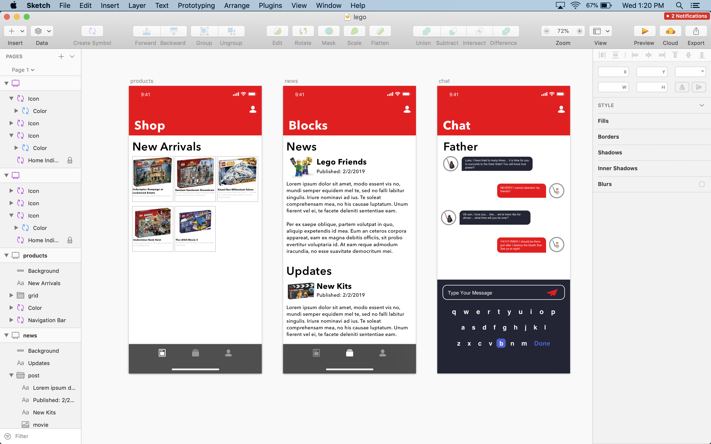

## Lego - UI/UX
This a UI/UX mockup I built in SketchApp. In addition to learning
more short-cuts, I also learned how to design and build more mockups 
in/with Sketch. I did not follow a tutorial for this design; I,
instead clone and made my own tweak from a gif in a Medium article.

I enjoyed designing this project/mockup because I taught myself 
more UI/UX practices. I also included the mockup if you (the reader)
would like to check out my work.

Catchphrase: Once this is completed, I will be a Unicorn!

---
